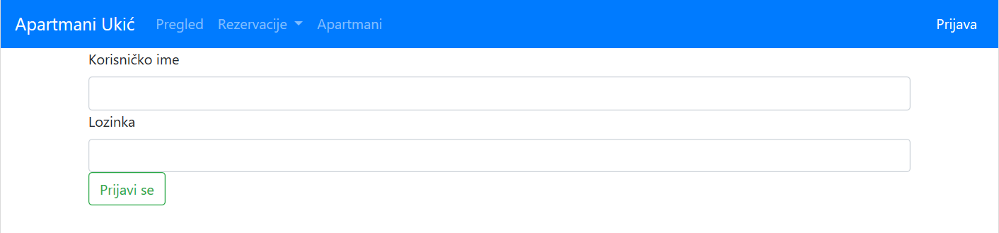
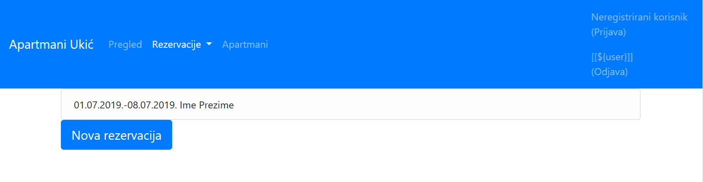
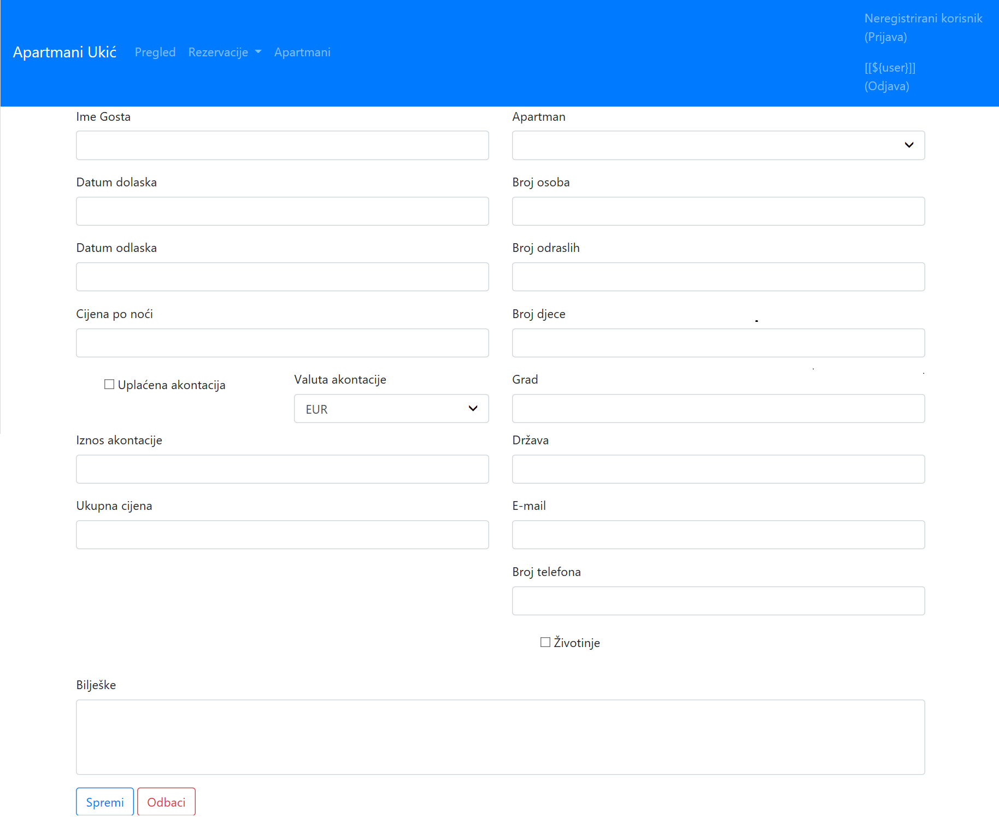
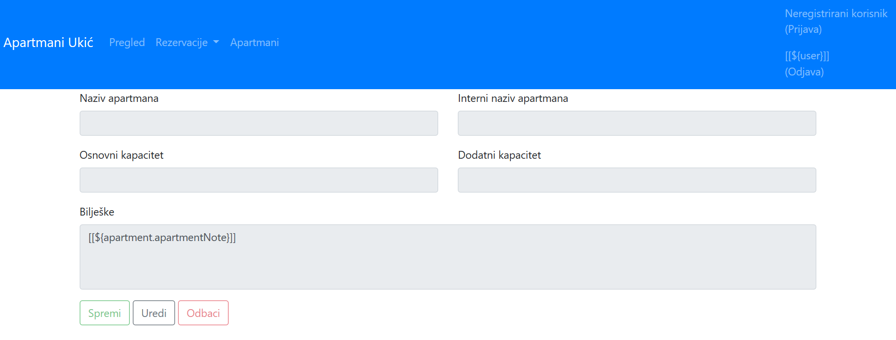

# apartment-manager-web

<h2>What is it?</h2>

Web application for tracking and managing apartment reservations.

<h2>Web resources</h2>

| resource            | description                                       |
| ------------------- |:--------------------------------------------------| 
| /reserved-dates     | reservations shown in calendar view month by month| 
| /reservations       | reservatios shown in list view                    |
| /reservations/{id}  | reservation details                               |
| /login              | login page                                        |
| /apartments         | apartments shown in list view                     |
| /apartments/{id}    | apartment details                                 |
| /reservations/new   | form for adding new reservation                   |

<h2>Authentication</h2>

Resources matching ant patterns "/reservations*" and "/reservations/*" are accessable only by authorised users with permission to access those resources.

<h2>Screenshots</h2>

Screenshots of available pages.

    
    <em>/reserved-dates</em>

    
    <em>/login</em>

    
    <em>/reservations</em>

    
    <em>/reservations/{id}</em>

    
    <em>/apartments</em>

    
    <em>/apartments/{id}</em>

<h2>API documentation</h2>

| resource           | description                 |
| ------------------ |:----------------------------| 
| /all-reservations  | reservations in JSON format | 
| /all-apartments    | apartments in JSON format   |

